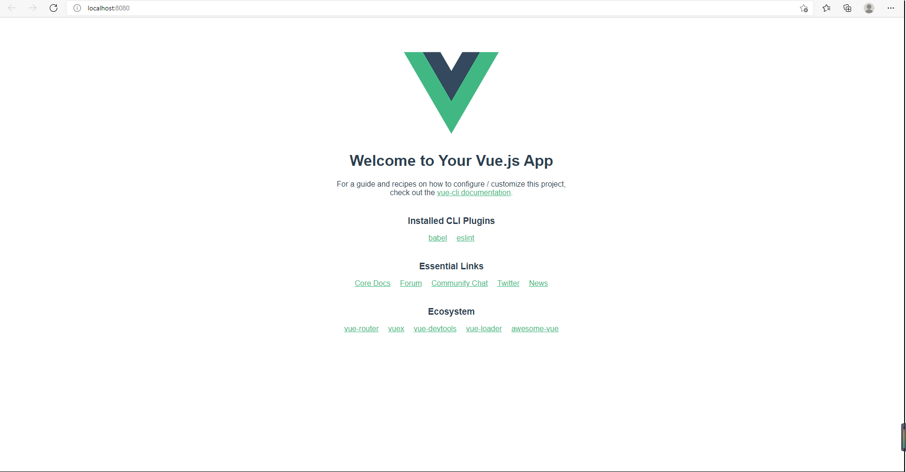

# Vue-learn
Vue的学习代码

# Vue

Vue3官方文档[👉点这里](https://v3.cn.vuejs.org/guide/introduction.html)

# 安装

使用npm安装vue-cli工具，便捷创建和管理项目。

```shell
npm install -g @vue/cli
```

# 创建项目

```shell
vue create hello-world
```

## 运行

```shell
cd hello-world
npm run serve
```

